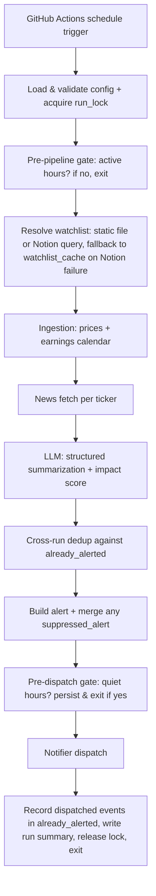

# Design Document: Stock News Agent

## Overview

The Stock News Agent is a Python-based scheduled pipeline that runs as a short-lived process on an ephemeral GitHub Actions runner. Each invocation resolves a watchlist (from a static file or a live Notion database query), fetches price data and news stories, passes them through an LLM for deduplication and summarization, and dispatches a formatted alert to one or more notification channels. The process starts, does its work, and exits — no persistent server, no background threads between runs, and no local disk state carried between invocations.

The system is composed of loosely coupled components that execute in a linear pipeline:

```
Scheduler (GitHub Actions schedule trigger)
    └─► Watchlist_Source (static file or Notion) ──► Ingestion_Module ──► News_Fetcher ──► LLM_Processor ──► Notifier
                                                            │                    │                  │                │
                                                       yfinance API        RSS / yfinance       OpenAI API     Telegram / Discord / SMTP
```

Key design decisions:
- **Stateless compute, stateful memory**: the agent process itself is short-lived and stateless, but a small `StateStore` (default: Redis, e.g. Upstash's free tier — required because GitHub Actions runners have no persistent disk between runs; pluggable to SQLite for local/dev) persists five things across runs — `already_alerted` (Event identity keys with TTL), `suppressed_alert` (Quiet_Hours holdover), `run_lock` (prevents overlap), `daily_cost_ledger` (LLM spend cap), and `watchlist_cache` (last-known-good Notion watchlist, for resilience against transient Notion API failures).
- **Pluggable watchlist source**: the same `WatchlistSource` interface is satisfied by a static YAML/JSON file or a live Notion database query filtered by an "include" checkbox property, so the personalized watchlist can live wherever the user already maintains it (their existing Notion stock-tracking database) rather than requiring a duplicate, hand-maintained list.
- **Cross-run deduplication is first-class**: every dispatched Event is recorded in `already_alerted` keyed by a deterministic identity hash so the same earnings story is never re-sent on the next scheduled run.
- **Single timezone**: one IANA `timezone` config field (e.g., `America/New_York`) interprets all human-facing time inputs. Logs are UTC, ingestion/market data is in the market timezone, display can be both.
- **Structured LLM output**: the LLM_Processor uses JSON-schema-constrained responses (OpenAI `response_format: json_schema` or equivalent function calling), so downstream parsing is reliable and the output always carries an `impact_score` for thresholded filtering.
- **Cost guardrails**: per-run input-token cap and per-day USD cost cap stop the pipeline gracefully and dispatch whatever was produced so far.
- **Fail-soft**: individual ticker or source failures are logged and skipped; the run continues for remaining tickers. LLM failures skip the ticker, not the run. A failed Notion watchlist fetch falls back to the cached watchlist rather than failing the run.
- **Structured logging to stdout**: all log output is newline-delimited JSON so GitHub Actions' log viewer/log capture picks it up without configuration.
- **Config-first**: a single YAML file drives all runtime parameters; environment variables (populated from GitHub Actions Secrets) override any value for secrets and deployment-specific settings.
- **Quiet hours and active hours are guards, not features**: they are a single `if-not-allowed: exit` check near the top of the pipeline; they do not warrant prominent placement in the architecture diagrams.

---

## Architecture

### Execution Flow

The pipeline is linear. Time-window guards (active hours, quiet hours) are collapsed into a single pre-pipeline `gate` step and a single pre-dispatch `gate` step so they do not dominate the diagram.



Error paths (config invalid, lock held by another run, cost cap hit, all channels fail) all converge to the run-summary log entry with appropriate severity before exit — they are not drawn here to keep the happy path readable.

### Component Boundaries

Each component is a Python class with a well-defined interface. Components communicate via plain Python dataclasses — no shared mutable state, no global variables.

```mermaid
classDiagram
    class Agent {
        +run(mode: RunMode) None
    }
    class ConfigLoader {
        +load(path: str) AgentConfig
        +validate(config: AgentConfig) list[str]
    }
    class WatchlistSource {
        <<interface>>
        +fetch() list[TickerEntry]
    }
    class StaticWatchlistSource {
        +fetch() list[TickerEntry]
    }
    class NotionWatchlistSource {
        +fetch() list[TickerEntry]
    }
    class StateStore {
        <<interface>>
        +get(key: str) bytes | None
        +set(key: str, value: bytes, ttl_seconds: int | None) None
        +delete(key: str) None
        +add_to_set(key: str, member: str, ttl_seconds: int) None
        +set_contains(key: str, member: str) bool
        +increment(key: str, amount: float) float
        +acquire_lock(key: str, ttl_seconds: int) LockToken | None
        +release_lock(token: LockToken) None
    }
    class IngestionModule {
        +fetch_prices(tickers: list[str]) dict[str, PriceData]
        +fetch_earnings_calendar(tickers: list[str]) dict[str, date | None]
        +calculate_price_movement(prices: PriceData, event_time: datetime, window_hours: int) PriceMovementResult
    }
    class NewsFetcher {
        +fetch_stories(ticker: str, lookback_hours: int) list[Story]
    }
    class LLMProcessor {
        +process(ticker: str, stories: list[Story], prices: PriceData) list[Event]
    }
    class CostGuard {
        +project_cost(tokens_in: int, tokens_out_estimate: int, model: str) float
        +would_exceed_cap(projected_cost: float) bool
        +record(actual_cost: float) None
    }
    class TimeGate {
        +in_active_hours(now: datetime) bool
        +in_quiet_hours(now: datetime) bool
    }
    class AlertBuilder {
        +build(events: list[Event], tickers_monitored: int, earnings_upcoming: dict) Alert
        +merge(current: Alert, suppressed: Alert | None) Alert
    }
    class DedupFilter {
        +filter(events: list[Event]) list[Event]
        +record_dispatched(events: list[Event]) None
    }
    class Notifier {
        +dispatch(alert: Alert, channels: list[ChannelConfig]) list[DeliveryResult]
        +test_channels(channels: list[ChannelConfig]) list[DeliveryResult]
    }
    class Logger {
        +info(component: str, message: str, **fields) None
        +warning(component: str, message: str, **fields) None
        +error(component: str, message: str, **fields) None
        +llm_call(model: str, tokens_in: int, tokens_out: int, cost_usd: float, severity: str) None
        +write_run_summary(summary: RunSummary) None
    }

    Agent --> ConfigLoader
    Agent --> WatchlistSource
    WatchlistSource <|.. StaticWatchlistSource
    WatchlistSource <|.. NotionWatchlistSource
    NotionWatchlistSource --> StateStore
    Agent --> StateStore
    Agent --> IngestionModule
    Agent --> NewsFetcher
    Agent --> LLMProcessor
    Agent --> CostGuard
    Agent --> TimeGate
    Agent --> AlertBuilder
    Agent --> DedupFilter
    Agent --> Notifier
    Agent --> Logger
    LLMProcessor --> CostGuard
    DedupFilter --> StateStore
    CostGuard --> StateStore
```



Note: `TimeGate` collapses the prior `QuietHoursManager` and the active-hours check into a single small pure-logic helper. Persistence concerns previously bundled into `QuietHoursManager` (suppressed-alert load/save) now live in `StateStore` under the `suppressed_alert` key.

### Deployment Architecture

The Agent is deployed as a **GitHub Actions scheduled workflow**, not a hosted service. A workflow file at `.github/workflows/agent.yml` runs on `ubuntu-latest`, checks out the repo, installs dependencies, and runs `python -m agent.main`. GitHub Actions executes this on the configured `schedule` trigger, waits for the process to exit, and captures stdout/stderr into the workflow run's log, viewable in the Actions tab.

**Three cron expressions** drive execution, pinned to the market clock: `35 13 * * 1-5` (09:35 ET, just after the open), `5 20 * * 1-5` (16:05 ET, just after the close), and `0 0 * * 2-6` (20:00 ET, evening — Mon–Fri ET is Tue–Sat in UTC). GitHub Actions evaluates `schedule` cron in UTC, which cannot follow US DST, so the hour fields are correct for EDT and land an hour earlier under EST; `active_hours_start`/`active_hours_end` are set wide enough to admit both regimes so the seasonal drift degrades timing rather than dropping runs. `TimeGate.in_active_hours()` is therefore a safety net rather than the schedule — it still blocks a stray manual dispatch or a badly delayed fire, exiting within ~100 ms. A `workflow_dispatch` trigger is also configured so a run can be fired manually (e.g. for `--test-channels` or `--dry-run` verification) from the GitHub UI or `gh workflow run`. Note GitHub's documented scheduling caveat: `schedule` triggers can be delayed several minutes during periods of high GitHub Actions load, and disabled automatically on repos with no activity for 60 days — acceptable for a personal alerting tool, but worth knowing if alerts seem to lag.

GitHub Actions runners are **ephemeral**: nothing written to the runner's local disk survives between runs, so unlike the earlier Railway-volume design, the default `StateStore` cannot be a local SQLite file. The default backend is **Redis**, via a free-tier **Upstash** database, addressed by `STATE_STORE_REDIS_URL`. The `SQLiteStateStore` implementation is retained in the codebase for local development and testing (`state_store.type: sqlite`) but is not a supported choice for the GitHub Actions deployment.

Sensitive environment variables (`ANTHROPIC_API_KEY`, `TELEGRAM_BOT_TOKEN`, `TELEGRAM_CHAT_ID`, `DISCORD_WEBHOOK_URL`, `SMTP_*`, `STATE_STORE_REDIS_URL`, `NOTION_API_TOKEN`) are set as **GitHub Actions repository secrets** (Settings → Secrets and variables → Actions) and injected into the job as `env:` entries mapped from `${{ secrets.* }}`; they are never committed to the repository or written into the YAML config file.

Example workflow skeleton (finalized in task 17.2):

```yaml
name: Stock News Agent
on:
  schedule:
    - cron: "35 13 * * 1-5"   # 09:35 ET -- just after the open
    - cron: "5 20 * * 1-5"    # 16:05 ET -- just after the close
    - cron: "0 0 * * 2-6"     # 20:00 ET -- evening (Mon-Fri ET = Tue-Sat UTC)
  workflow_dispatch: {}
concurrency:
  group: stock-news-agent
  cancel-in-progress: false
jobs:
  run:
    runs-on: ubuntu-latest
    steps:
      - uses: actions/checkout@v4
      - uses: actions/setup-python@v5
        with:
          python-version: "3.12"
      - run: pip install -r requirements.txt
      - run: python -m agent.main
        env:
          ANTHROPIC_API_KEY: ${{ secrets.ANTHROPIC_API_KEY }}
          NOTION_API_TOKEN: ${{ secrets.NOTION_API_TOKEN }}
          STATE_STORE_REDIS_URL: ${{ secrets.STATE_STORE_REDIS_URL }}
          TELEGRAM_BOT_TOKEN: ${{ secrets.TELEGRAM_BOT_TOKEN }}
          TELEGRAM_CHAT_ID: ${{ secrets.TELEGRAM_CHAT_ID }}
          DISCORD_WEBHOOK_URL: ${{ secrets.DISCORD_WEBHOOK_URL }}
```

The `concurrency` block is a first line of defense against overlapping runs (e.g. a manual `workflow_dispatch` firing while a scheduled run is still in progress); the `run_lock` StateStore record (Requirement 2.4) remains the authoritative guard since `concurrency` only protects within GitHub Actions, not against, say, a run triggered from a developer's machine against the same Redis instance.

---

## Components and Interfaces

### ConfigLoader

Responsible for reading, merging, and validating all configuration. Environment variables override config file values for any key.

**Input**: path to YAML or JSON config file  
**Output**: validated `AgentConfig` dataclass, or exits with error

```python
@dataclass
class AgentConfig:
    watchlist_source: str                # "static" | "notion"
    watchlist: list[TickerEntry] | None  # populated when watchlist_source == "static"
    notion: NotionConfig | None          # populated when watchlist_source == "notion"
    timezone: str                       # IANA, e.g. "America/New_York"
    lookback_window_hours: int          # default: 24
    price_window_hours: int             # default: 2
    llm_model: str                      # default: "claude-haiku-4-5"
    llm_provider: str | None            # "anthropic" (default) | "openai"
    impact_threshold: int               # default: 6 (0–10)
    high_impact_categories: list[str]
    benchmark_index: str                # default: "SPY"
    cron_schedule: str                  # single 5-field cron expression
    active_hours_start: str             # "HH:MM" in `timezone`
    active_hours_end: str               # "HH:MM" in `timezone`
    quiet_hours: QuietHoursConfig | None
    channels: list[ChannelConfig]
    news_sources: list[str]             # e.g. ["yfinance", "google_news", "finviz"]
    state_store: StateStoreConfig
    cost: CostConfig
    already_alerted_ttl_hours: int      # default: 168 (7 days)

@dataclass
class TickerEntry:
    symbol: str
    group: str | None = None

@dataclass
class NotionConfig:
    database_id: str
    title_property: str = "Name"            # property to parse "(TICKER)" from
    include_property: str = "Track in Agent"  # checkbox property gating inclusion
    group_property: str | None = None       # optional select/status property for group label
    ticker_pattern: str = r"\(([A-Z0-9.]{1,10})\)"

@dataclass
class StateStoreConfig:
    type: str                           # "redis" (default/deployed) | "sqlite" (local/dev) | "memory" (test-only)
    path: str | None = None             # sqlite only, e.g. local "./agent_state.db"

@dataclass
class CostConfig:
    max_input_tokens_per_run: int       # default: 100_000
    daily_cost_cap_usd: float           # default: 1.00
    model_pricing: dict[str, ModelPricing]  # per-model USD per 1M tokens

@dataclass
class ModelPricing:
    input_per_1m_usd: float
    output_per_1m_usd: float
```

Environment variable override convention: `AGENT_<KEY>` (e.g., `AGENT_LLM_MODEL=claude-haiku-4-5`). Sensitive values (API keys, tokens) are **only** available as environment variables and are never present in the config file schema.

### WatchlistSource

Resolves the run's Watchlist. A one-method interface, satisfied by two implementations selected via `watchlist_source`:

- **StaticWatchlistSource** — reads `config.watchlist` directly (the original static-file behavior); `fetch()` is a pure in-memory operation, no I/O.
- **NotionWatchlistSource** — calls the Notion API (`GET /v1/databases/{database_id}/query`, or the newer data-source query endpoint) using `NOTION_API_TOKEN`, filtering server-side where possible on `notion.include_property == true`. For each returned page: reads `notion.title_property`, applies `notion.ticker_pattern` (default `\(([A-Z0-9.]{1,10})\)`), and builds a `TickerEntry`. Pages with no regex match are logged as a warning (`component=NotionWatchlistSource`, includes the Notion page URL) and dropped rather than failing the run. If `notion.group_property` is set, its value becomes `TickerEntry.group`.

**Caching and fallback**: on every successful `NotionWatchlistSource.fetch()`, the resulting `list[TickerEntry]` is serialized and written to `StateStore` under `watchlist_cache` (no TTL — overwritten each success, not expired). If the Notion API call fails (timeout, 5xx, auth error), `fetch()` logs a `warning`, reads `watchlist_cache` from the StateStore, and returns that instead; if no cache exists yet (e.g. first-ever run and Notion is down), the Agent logs an `error` and exits 0 without sending an Alert — the same treatment as "all tickers invalid" elsewhere in the design, since this is expected to self-resolve on the next scheduled run.

This mirrors the pluggable-backend pattern already used for `StateStore`: a small interface, swappable implementations, factory-selected from config. Notion calls happen once per run, before Ingestion — the same `list[TickerEntry]` this produces flows into the existing ticker validation/deduplication step (Requirement 1.7) unchanged, so everything downstream of "we have a watchlist" is identical regardless of source.

### IngestionModule

Wraps yfinance. Fetches intraday (5-minute) and daily OHLCV data plus upcoming earnings dates. Calculates `Price_Movement` as a pure function with explicit rules for non-market-hours and weekend events.

**Key methods**:
- `fetch_prices(tickers)` — calls `yfinance.download()` with `interval="5m"` for intraday and `interval="1d"` for daily trailing 5 days. Returns a dict mapping ticker → `PriceData`.
- `fetch_earnings_calendar(tickers)` — calls `yf.Ticker(t).calendar` for each ticker; returns a dict mapping ticker → next earnings date (or `None`). Failures per ticker are logged as warnings and the ticker maps to `None`.
- `calculate_price_movement(prices, event_time, window_hours)` — pure function returning a `PriceMovementResult` with `value: float | None`, `pending: bool`, and `truncated: bool`.

**Price-movement anchoring rules** (Req 3.5):

| Event publication time | Start anchor | End anchor |
|---|---|---|
| Regular market hours | Close of bar at/just-before `event_time` | Close of bar at `event_time + window` (or last available) |
| Pre-market (before 09:30 local) | Prior session close | Current session open + window (or last available) |
| After-hours / weekend / holiday | Most recent session close | Next session open + window (or last available) |
| Next session not yet open | — | `pending: true`; reconcile on a later run |

When `pending: true`, the Event is emitted without a Price_Movement and `price_movement_pending` is set on the Event so the LLM_Processor can elide the `market_reaction` field. The next run after the next session opens recomputes and would reconcile via the suppressed-alert merge if still relevant.

Tickers that yfinance cannot resolve are logged as warnings and excluded from the result dict. If the result dict is empty, the agent logs an error and exits.

### NewsFetcher

Queries multiple news sources and returns a unified, deduplicated list of `Story` objects for a given ticker.

**Source adapters** (each implements `NewsSourceAdapter`):
- `YFinanceNewsAdapter` — calls `yf.Ticker(symbol).news`
- `GoogleNewsRSSAdapter` — queries `https://news.google.com/rss/search?q={ticker}+stock` via `feedparser`
- `FinvizNewsAdapter` — scrapes Finviz news table via `requests` + `BeautifulSoup`
- `YahooFinanceRSSAdapter` — queries Yahoo Finance RSS feed via `feedparser`

Each adapter has a 30-second timeout. Failures are caught, logged as warnings, and skipped. Stories are filtered to the `Lookback_Window` before being returned.

Deduplication within a run:
1. Exact URL match → discard duplicate
2. `(ticker, headline, publication_timestamp)` match → discard duplicate

### LLMProcessor

Sends batched, structured-output prompts to the configured LLM API. Handles deduplication of cross-source stories, scoring of impact, filtering to high-impact categories, and summary generation.

**Prompt strategy**: one API call per ticker with all stories for that ticker included. The prompt instructs the model to:
1. Group stories that describe the same event.
2. For each group, identify the category (from the configured list), assign an `impact_score` (0–10), and produce a ≤150-word summary with at least one source URL.
3. If price movement data is provided, populate a `market_reaction` field comparing the ticker's movement to the configured `benchmark_index` movement over the same window (distinguishing idiosyncratic vs. macro-driven movement).

**Structured output**: the API call uses OpenAI's `response_format={"type": "json_schema", ...}` (or function calling for models that don't support `json_schema`). The schema is:

```json
{
  "type": "object",
  "properties": {
    "events": {
      "type": "array",
      "items": {
        "type": "object",
        "properties": {
          "headline": {"type": "string"},
          "summary": {"type": "string", "maxLength": 1200},
          "category": {"type": "string", "enum": ["earnings_release", "regulatory_ruling", "product_launch", "analyst_rating_change", "macroeconomic_announcement", "other"]},
          "impact_score": {"type": "integer", "minimum": 0, "maximum": 10},
          "source_urls": {"type": "array", "items": {"type": "string"}, "minItems": 1},
          "market_reaction": {"type": ["string", "null"]}
        },
        "required": ["headline", "summary", "category", "impact_score", "source_urls"]
      }
    }
  },
  "required": ["events"]
}
```

If the response fails schema validation, the LLMProcessor retries once with the validation error appended to the prompt; a second validation failure logs `error` and skips the ticker.

**Cost guarding**: before sending, `LLMProcessor` calls `CostGuard.project_cost(tokens_in, tokens_out_estimate, model)` and skips the call if `would_exceed_cap()` returns true (logs a `warning` with current ledger value). After every call (success or failure), `CostGuard.record(actual_cost)` updates the `daily_cost_ledger` in the StateStore.

**Retry logic**: single retry after 5-second wait on timeout or transient API error. If both attempts fail, the ticker is skipped for LLM processing (not the whole run) and an error is logged.

**Token logging**: after every API call (success or failure), a JSON log entry is written with `run_id`, `model`, `input_tokens`, `output_tokens`, `estimated_cost_usd`, `severity`.

### Notifier

Dispatches the formatted `Alert` to all configured channels. Each channel type has an adapter:

- `TelegramAdapter` — HTTP POST to `https://api.telegram.org/bot{token}/sendMessage` with `parse_mode=MarkdownV2`. Body ≤4096 chars (Telegram hard limit); long alerts are split into multiple messages preserving event boundaries.
- `DiscordAdapter` — HTTP POST to the configured webhook URL. Plain content ≤2000 chars; longer alerts use Discord embeds (≤6000 chars across all embed fields, ≤4096 per field).
- `EmailAdapter` — SMTP via Python's `smtplib` or a transactional API (e.g., SendGrid). Body is unbounded; HTML and plain-text alternatives are sent.

**Per-channel character limits**: enforced by each adapter (Telegram=4096, Discord=2000 plain / 6000 embed, email=unbounded). Subject/title ≤200 chars across all channels.

**Retry**: dispatch failures with transient errors (timeout, 5xx, 429) trigger one retry after a 2-second backoff. Non-transient failures (4xx other than 429) skip retry. All failures are logged with channel name and error details; remaining channels are still attempted.

**Test-channels mode**: `Notifier.test_channels(channels)` sends a canned `"Stock News Agent: channel test, <ISO timestamp>"` to every configured channel, returning per-channel `DeliveryResult`s. Used by the `--test-channels` CLI flag.

### TimeGate

A small pure-logic helper exposing two methods: `in_active_hours(now)` and `in_quiet_hours(now)`. Both operate in the configured `timezone` via `zoneinfo`. `in_quiet_hours` handles midnight-spanning ranges (e.g., 22:00–06:00). TimeGate does **not** touch persistence — suppression of quiet-hours alerts is handled by the Agent reading/writing `suppressed_alert` via `StateStore`.

### StateStore

A pluggable persistent KV/set/counter store. Three backends:

- **SQLiteStateStore** (local development and testing only): single SQLite file on disk. Tables for `kv` (with `expires_at`), `set_members` (with per-member TTL), and `counters` (with date partition key). Light wrapper around `sqlite3`; uses `WITH IMMEDIATE` transactions to make lock acquisition atomic.
- **RedisStateStore** (default, deployed): thin wrapper over `redis-py` using native commands (`SETEX`, `SADD` + `EXPIRE`, `INCRBYFLOAT`, `SET ... NX EX`).
- **MemoryStateStore**: in-process dict, test-only. The Agent refuses to start in `live` mode with this backend.

Public interface (see class diagram). `acquire_lock(key, ttl_seconds)` returns a `LockToken` on success or `None` if a live lock already exists; `release_lock(token)` deletes the record iff the token matches (prevents stale-release races).

If the configured backend is unreachable at startup, the Agent logs `error` and exits with code 1 rather than silently disabling deduplication.

### DedupFilter

Stateless transformer with one State_Store dependency. Two methods:

- `filter(events)` — for each event, computes the identity key (`sha256(normalized_url)` if URL present, else `sha256(ticker + lowercased_headline + ISO8601_date)`) and drops any event whose key is already in the `already_alerted` set in the StateStore.
- `record_dispatched(events)` — called after successful dispatch to at least one channel; inserts each dispatched event's identity key into `already_alerted` with `already_alerted_ttl_hours` TTL.

### CostGuard

Wraps the `daily_cost_ledger` counter and the per-run input-token budget. Methods:

- `project_cost(tokens_in, tokens_out_estimate, model)` — returns USD using the per-model pricing table.
- `would_exceed_cap(projected_cost)` — returns true if `current_daily_total + projected_cost > daily_cost_cap_usd`.
- `record(actual_cost)` — increments `daily_cost_ledger[UTC_date]` atomically via StateStore.

### AlertBuilder

Builds the `Alert` dataclass from a list of `Event`s. Sorts by descending `impact_score`, then descending `|price_movement|`, then ascending ticker. Groups by ticker (and group label if configured). Renders upcoming-earnings section. `merge(current, suppressed)` deduplicates Events between current and suppressed alerts by identity key.

### Operational Modes

A `RunMode` enum (`live`, `dry_run`, `test_channels`, `backtest`) is passed to `Agent.run(mode)`:

- **live** — default; full pipeline.
- **dry_run** — runs full pipeline including (by default) live LLM calls; writes the would-be Alert JSON to stdout; skips Notifier and skips `DedupFilter.record_dispatched`. `--dry-run --no-llm` substitutes a deterministic canned LLM response and writes nothing to the StateStore.
- **test_channels** — bypasses ingestion, news, LLM; calls `Notifier.test_channels`; exits with non-zero on any failure.
- **backtest** — loads `fixtures/backtest/<YYYY-MM-DD>.json`, replays through LLM (or with `--no-llm`, canned), prints Alert to stdout; never dispatches, never writes StateStore.

CLI dispatch lives in `agent/main.py` using `argparse`. Every log entry includes a `mode` field.

### Logger

Thin wrapper around `structlog` configured for newline-delimited JSON on `sys.stdout`. All components receive a `Logger` instance via constructor injection. The `run_id` (UUID4 generated at startup) and `mode` are bound to the logger at start and included in every entry.

---

## Data Models

```python
from dataclasses import dataclass, field
from datetime import datetime
from typing import Optional

@dataclass
class Story:
    ticker: str
    headline: str
    url: str                    # source name if URL unavailable
    published_at: datetime
    source: str
    word_count: int = 0

@dataclass
class PriceData:
    ticker: str
    intraday: list[OHLCVBar]    # 5-minute bars for current session
    daily: list[OHLCVBar]       # daily bars for trailing 5 days

@dataclass
class OHLCVBar:
    timestamp: datetime
    open: float
    high: float
    low: float
    close: float
    volume: int

@dataclass
class Event:
    ticker: str
    group: Optional[str]              # ticker group label, if configured
    headline: str
    summary: str                      # ≤150 words
    category: str                     # one of high_impact_categories
    impact_score: int                 # 0–10
    source_urls: list[str]
    identity_key: str                 # sha256 hash, see DedupFilter
    price_movement: Optional[float]   # percentage, None if unavailable or pending
    price_movement_pending: bool      # True if next-session open not yet known
    price_window_hours: int
    market_reaction: Optional[str]    # 1-sentence; None if no price data

@dataclass
class PriceMovementResult:
    value: Optional[float]
    pending: bool
    truncated: bool

@dataclass
class Alert:
    run_id: str
    run_timestamp_utc: datetime
    run_timestamp_local: datetime     # rendered in configured timezone
    tickers_monitored: int
    events: list[Event]               # sorted by impact_score desc, then |price_movement| desc, then ticker asc
    earnings_upcoming: dict[str, date]  # ticker -> earnings date, only within 7 days

@dataclass
class QuietHoursConfig:
    start: str                  # "HH:MM" 24-hour
    end: str                    # "HH:MM" 24-hour

@dataclass
class ChannelConfig:
    type: str                   # "telegram" | "discord" | "email"
    # connection params read from environment variables at runtime

@dataclass
class DeliveryResult:
    channel_type: str
    status: str                 # "success" | "failure" | "skipped"
    error: Optional[str]

@dataclass
class RunSummary:
    run_id: str
    mode: str                           # "live" | "dry_run" | "test_channels" | "backtest"
    severity: str
    run_start_time: datetime            # UTC
    run_end_time: datetime              # UTC
    tickers_processed: list[str]
    stories_fetched_per_source: dict[str, int]
    events_identified: int              # before dedup
    events_dispatched: int              # after dedup against already_alerted
    events_skipped_already_alerted: int
    delivery_channel_statuses: list[DeliveryResult]
    llm_cost_usd_this_run: float
    daily_cost_usd_running_total: float
    errors: list[dict]
```

### Configuration File Schema (YAML example)

```yaml
timezone: America/New_York

watchlist_source: notion   # "notion" | "static"

notion:
  database_id: ""                                       # set AGENT_NOTION_DATABASE_ID instead
  title_property: "Name"                # ticker parsed from "(TICKER) Company Name"
  include_property: "Track in Agent"    # checkbox property added to the Stocks DB
  group_property: null                  # e.g. "Currency" or a new Sector-like property, optional

# Used only when watchlist_source: static
watchlist:
  - symbol: AAPL
    group: core_holdings
  - symbol: TSLA
    group: watchlist
  - symbol: MSFT
    group: core_holdings
  - symbol: SPY
    group: macro

lookback_window_hours: 24
price_window_hours: 2

llm_model: claude-haiku-4-5
llm_provider: anthropic
impact_threshold: 6
benchmark_index: SPY

high_impact_categories:
  - earnings_release
  - regulatory_ruling
  - product_launch
  - analyst_rating_change
  - macroeconomic_announcement

cron_schedule:            # informational; mirrors the workflow
  - "35 13 * * 1-5"
  - "5 20 * * 1-5"
  - "0 0 * * 2-6"
active_hours_start: "08:30"   # safety net, not the schedule
active_hours_end: "22:00"

quiet_hours:
  start: "20:00"
  end: "08:00"

news_sources:
  - yfinance
  - google_news
  - finviz

channels:
  - type: telegram
  - type: discord

state_store:
  type: redis
  path: null   # only used when type: sqlite (local/dev)

already_alerted_ttl_hours: 168

cost:
  max_input_tokens_per_run: 100000
  daily_cost_cap_usd: 1.00
  model_pricing:
    claude-haiku-4-5:
      input_per_1m_usd: 1.00
      output_per_1m_usd: 5.00
```

Sensitive values (never in config file; set as GitHub Actions repository secrets):
- `ANTHROPIC_API_KEY` (or `OPENAI_API_KEY` when `llm_provider: openai`)
- `NOTION_API_TOKEN` (only when `watchlist_source: notion`)
- `TELEGRAM_BOT_TOKEN`, `TELEGRAM_CHAT_ID`
- `DISCORD_WEBHOOK_URL`
- `SMTP_HOST`, `SMTP_PORT`, `SMTP_USER`, `SMTP_PASSWORD`, `SMTP_TO`
- `STATE_STORE_REDIS_URL` (required for the GitHub Actions deployment; default backend is `redis`)

---

## Correctness Properties

*A property is a characteristic or behavior that should hold true across all valid executions of a system — essentially, a formal statement about what the system should do. Properties serve as the bridge between human-readable specifications and machine-verifiable correctness guarantees.*

### Property 1: Ticker deduplication is idempotent

*For any* list of ticker symbols (including lists with duplicates), the deduplicated watchlist shall contain no duplicate entries, and every unique symbol from the original list shall appear exactly once.

**Validates: Requirements 1.3**

---

### Property 2: Ticker format validation accepts valid symbols and rejects invalid ones

*For any* string that matches the pattern `[A-Z0-9]{1,10}(\.[A-Z]{1,4})?`, the ticker validator shall accept it; *for any* string that does not match this pattern, the ticker validator shall reject it.

**Validates: Requirements 1.3**

---

### Property 3: Active-hours suppression is correct for all timestamps

*For any* timestamp and any configured active-hours range, the agent shall suppress execution if and only if the timestamp falls outside the active-hours range.

**Validates: Requirements 2.2**

---

### Property 4: Price movement calculation is correct for any price series

*For any* price series and event timestamp within regular market hours, the calculated `Price_Movement.value` shall equal `(close_at_end_of_window - close_at_event_time) / close_at_event_time * 100`, where `close_at_end_of_window` is the last available close price within the price window.

*For any* event timestamp outside regular market hours, the calculated `Price_Movement` shall follow the anchoring table in the IngestionModule section, OR shall return `pending: true` when the relevant next session has not yet opened.

**Validates: Requirements 3.4, 3.5**

---

### Property 5: News stories are filtered to the lookback window

*For any* list of stories with arbitrary publication timestamps and any lookback window duration, all stories returned by the News_Fetcher shall have a `published_at` timestamp within `[now - lookback_window, now]`.

**Validates: Requirements 4.3**

---

### Property 6: Every story has required association fields

*For any* story fetched from any source, the story object shall have non-empty `ticker`, `published_at`, and `url` (or source name) fields.

**Validates: Requirements 4.5**

---

### Property 7: Story deduplication removes all duplicate URLs and composite-key matches

*For any* list of stories containing duplicates (by exact URL or by `(ticker, headline, published_at)` combination), the deduplicated list shall contain no two stories with the same URL and no two stories with the same `(ticker, headline, published_at)` triple.

**Validates: Requirements 4.7**

---

### Property 8: LLM cross-source deduplication retains the story with the greatest word count and merges URLs

*For any* group of stories describing the same event (same ticker and event), after LLM deduplication the retained story shall be the one with the maximum word count, and its `source_urls` shall be the union of all unique URLs from the group.

**Validates: Requirements 5.1**

---

### Property 9: Event summaries never exceed the word limit

*For any* LLM-generated event summary, the processed summary shall contain no more than 150 words; *for any* "no significant events" summary, it shall contain no more than 50 words.

**Validates: Requirements 5.3, 5.5**

---

### Property 10: LLM call log entries always contain required fields

*For any* LLM API call (success or failure), the log entry written shall be valid JSON containing `run_id`, `model`, `input_tokens`, `output_tokens`, and `severity`.

**Validates: Requirements 5.6, 9.3**

---

### Property 11: Alert payload always contains all required fields for every event

*For any* set of events, the formatted `Alert` payload shall contain for each event: `ticker`, `headline`, `summary` (≤150 words), `price_movement` (or null), and at least one `source_url`.

**Validates: Requirements 6.1**

---

### Property 12: Events are sorted by descending impact then absolute price movement, with alphabetical tiebreaking

*For any* list of events with arbitrary `impact_score`, `price_movement`, and `ticker` values, the sorted alert shall order events by descending `impact_score`, with ties broken by descending `|price_movement|` and then by ascending alphabetical `ticker`.

**Validates: Requirements 6.2**

---

### Property 13: Alert header always contains UTC ISO 8601 timestamp and correct ticker count

*For any* run, the alert header shall contain a `run_timestamp` that is a valid UTC ISO 8601 datetime string and a `tickers_monitored` count equal to the number of tickers in the watchlist for that run (including tickers with no events).

**Validates: Requirements 6.4**

---

### Property 14: Notifier dispatches to all configured channels

*For any* set of configured delivery channels (1 or more), the Notifier shall attempt dispatch to every channel in the set.

**Validates: Requirements 7.3**

---

### Property 15: Formatted message body and subject never exceed character limits

*For any* alert content, the formatted message body shall not exceed 4000 characters and the subject/title shall not exceed 200 characters.

**Validates: Requirements 7.5**

---

### Property 16: Quiet-hours suppression is correct for all timestamps and ranges (including midnight-spanning)

*For any* timestamp and any quiet-hours range (including ranges that span midnight, e.g., 22:00–06:00), the Notifier shall suppress delivery if and only if the timestamp falls within the quiet-hours range.

**Validates: Requirements 8.2, 8.6**

---

### Property 17: Suppressed alerts are delivered at the first run after quiet hours end

*For any* quiet-hours range and sequence of run timestamps, a suppressed alert from the last run within quiet hours shall be delivered at the first run timestamp that falls outside the quiet-hours range.

**Validates: Requirements 8.5**

---

### Property 18: Run-level log entries always contain all required fields

*For any* completed run, the run-level log entry shall be valid JSON containing `run_id`, `severity`, `run_start_time`, `run_end_time`, `tickers_processed`, `stories_fetched_per_source`, `events_identified`, `delivery_channel_statuses`, and `errors`.

**Validates: Requirements 9.1**

---

### Property 19: Component error log entries always contain required fields

*For any* error occurring in any component, the log entry shall be valid JSON containing `component`, `error_type`, and `message`.

**Validates: Requirements 9.2**

---

### Property 20: Environment variables always take precedence over config file values

*For any* configuration key present in both the config file and as an environment variable, the resolved value shall equal the environment variable value.

**Validates: Requirements 10.1**

---

### Property 21: Config validation reports all errors before any data fetching

*For any* configuration with multiple validation errors, all errors shall be reported in a single startup pass, and no calls to yfinance or any HTTP endpoint shall occur before the validation pass completes.

**Validates: Requirements 10.4**

---

### Property 22: Config validation accepts valid values and rejects invalid ones for all fields

*For any* configuration value for watchlist length, Lookback_Window, Price_Window, Quiet_Hours, cron schedule, Delivery_Channel type, `timezone`, `impact_threshold`, and `daily_cost_cap_usd`, the validator shall accept values that satisfy the specified constraints and reject values that do not, with a descriptive error message identifying the failing key.

**Validates: Requirements 10.5**

---

### Property 23: Cross-run deduplication never dispatches the same Event twice

*For any* sequence of runs where an Event with identity key `k` is dispatched in run N, the Event with identity key `k` shall be excluded from every subsequent run's outgoing Alert until `already_alerted_ttl_hours` has elapsed since the dispatch.

**Validates: Requirements 11.4, 11.5**

---

### Property 24: Event identity key is deterministic and source-agnostic

*For any* two Story inputs describing the same underlying Event (same normalized URL OR same `(ticker, lowercased_headline, ISO8601_date)`), the computed identity key shall be equal, regardless of source or fetch order.

**Validates: Requirements 11.3**

---

### Property 25: StateStore acquire_lock prevents overlapping runs

*For any* two concurrent attempts to acquire the same lock key within the lock TTL window, exactly one shall succeed and the other shall return `None`; the unsuccessful caller shall not be able to release the lock token of the successful caller.

**Validates: Requirements 2.4, 11.2**

---

### Property 26: LLM responses validate against the JSON schema or trigger one validation retry

*For any* LLM API response, either it shall parse and validate against the Event JSON schema, OR the LLMProcessor shall issue exactly one validation retry with the schema error embedded in the prompt; a second validation failure shall log `error` and skip the ticker (not crash the run).

**Validates: Requirements 5.2, 5.10**

---

### Property 27: Impact threshold filtering is correct

*For any* set of LLM-produced Events with arbitrary `impact_score` values 0–10 and a configured `impact_threshold` `t`, the outgoing Alert shall contain exactly those Events where `impact_score >= t` AND `category` ∈ configured `high_impact_categories`.

**Validates: Requirements 5.3**

---

### Property 28: Daily cost cap is never exceeded

*For any* sequence of LLM calls in a single UTC day, the cumulative `estimated_cost_usd` recorded in `daily_cost_ledger` shall never exceed `daily_cost_cap_usd + cost_of_last_call_before_cap_hit`, where the last-call slack exists only because the cap is checked pre-call against a projection.

**Validates: Requirements 12.2**

---

### Property 29: Per-run input token cap is never exceeded

*For any* run, the cumulative input tokens across all LLM calls shall not exceed `max_input_tokens_per_run + tokens_in_last_pre-cap_call`; once the cap is hit, no further LLM calls shall be initiated in that run.

**Validates: Requirements 12.1**

---

### Property 30: Notifier retries transient errors exactly once

*For any* dispatch attempt that fails with a transient error (timeout, 5xx, 429), the Notifier shall issue exactly one retry after a 2-second backoff; *for any* dispatch attempt that fails with a non-transient 4xx (other than 429), the Notifier shall NOT retry.

**Validates: Requirements 7.4**

---

### Property 31: Per-channel character limits are enforced per-adapter

*For any* Alert dispatched to Telegram, the body delivered to a single Telegram API call shall be ≤4096 chars (with multi-message splitting preserving event boundaries when needed); for Discord, plain content ≤2000 chars OR embeds totaling ≤6000 chars; subject ≤200 chars across all channels.

**Validates: Requirements 7.5**

---

### Property 32: Dry-run mode never dispatches and never writes the StateStore's already_alerted set

*For any* `--dry-run` invocation, the Notifier shall not be called and no entries shall be added to `already_alerted`. Backtest mode shall additionally write no entries to any StateStore key.

**Validates: Requirements 13.1, 13.3**

---

### Property 33: Earnings calendar surfacing window

*For any* set of fetched earnings dates, the Alert's `earnings_upcoming` section shall contain exactly those `(ticker, earnings_date)` pairs where `0 <= (earnings_date - run_date_in_market_tz) <= 7 days`.

**Validates: Requirements 3.7, 6.5**

---

### Property 34: Notion watchlist sync includes exactly the checked, parseable rows

*For any* set of Notion database pages with arbitrary values for the `include_property` checkbox and arbitrary title-property text, the Watchlist produced by `NotionWatchlistSource.fetch()` shall contain exactly those pages where `include_property` is `true` AND the title property contains a substring matching `notion.ticker_pattern`; pages failing either condition shall be excluded (and, for an unmatched title on an included page, logged as a warning) rather than causing the fetch to fail.

**Validates: Requirements 1.3, 1.4**

---

### Property 35: Notion fetch failure falls back to the cached watchlist, never silently to an empty watchlist

*For any* sequence of runs where a prior run successfully cached a Notion watchlist snapshot, a subsequent run whose live Notion query fails shall use the cached snapshot rather than proceeding with zero tickers or crashing; only when no cache exists shall the Agent exit without sending an Alert.

**Validates: Requirements 1.6**

---

## Error Handling

### Error Classification

| Error Type | Behavior | Recoverable? |
|---|---|---|
| Config file missing or unparseable | Log error, exit 1 | No |
| Missing required config key | Log error to stderr, exit 1 | No |
| Config validation failure | Log all errors to stderr, exit 1 | No |
| Invalid IANA `timezone` | Log error, exit 1 | No |
| Missing required credentials (env vars) | Log error, exit 1 | No |
| StateStore backend unreachable at startup | Log error, exit 1 | No |
| `run_lock` already held (overlapping run) | Log warning, exit 0 | No |
| Notion watchlist query fails, cache available | Log warning, use `watchlist_cache` from StateStore, continue | Yes |
| Notion watchlist query fails, no cache available | Log error, exit 0 (no alert) | No |
| Notion page's title has no parseable `(TICKER)` | Log warning, exclude that page from watchlist | Yes |
| Unrecognized ticker (yfinance) | Log warning, skip ticker | Yes |
| All tickers invalid | Log error, exit 0 (no alert) | No |
| yfinance returns empty data for ticker | Log warning, exclude ticker | Yes |
| News source timeout / error | Log warning, skip source | Yes |
| All news sources fail for a ticker | Log error, return empty story list | Yes |
| LLM API timeout / error (first attempt) | Wait 5s, retry | Yes |
| LLM API timeout / error (second attempt) | Log error, skip LLM for **ticker** (continue run) | Yes |
| LLM JSON-schema validation failure (first) | Retry with error in prompt | Yes |
| LLM JSON-schema validation failure (second) | Log error, skip ticker | Yes |
| Per-run input-token cap reached | Log warning, dispatch with events so far | Yes |
| Daily cost cap reached | Log warning, dispatch with events so far | Yes |
| Delivery channel transient (5xx/timeout/429) | Retry once after 2s, then skip | Yes |
| Delivery channel dispatch failure (non-transient) | Log failure, continue to next channel | Yes |
| All delivery channels fail | Log error, exit 0 (run logged, suppressed_alert NOT cleared) | No |
| Zero delivery channels configured | Log error, exit 0 | No |

### Unrecoverable Error Exit Codes

- Exit code `1`: configuration errors (missing file, validation failures, missing credentials)
- Exit code `0`: all other cases (including partial failures) — a non-zero exit would mark the workflow run red for a recoverable condition

### Error Log Format

Every error produces a JSON log entry on stdout:

```json
{
  "run_id": "uuid4",
  "severity": "error",
  "component": "NewsFetcher",
  "error_type": "SourceTimeout",
  "message": "Source 'google_news' did not respond within 30s for ticker AAPL",
  "timestamp": "2024-01-15T14:30:00Z"
}
```

---

## Testing Strategy

### Dual Testing Approach

The test suite uses both example-based unit tests (pytest) and property-based tests (Hypothesis). They are complementary:

- **Unit tests** cover specific examples, integration points, and edge cases
- **Property tests** verify universal invariants across randomly generated inputs

### Property-Based Testing Library

**[Hypothesis](https://hypothesis.readthedocs.io/)** is the chosen PBT library for Python. It integrates natively with pytest, provides rich strategy combinators for generating structured data, and automatically shrinks failing examples to minimal counterexamples.

Each property test is configured with `@settings(max_examples=100)` (minimum) and tagged with a comment referencing the design property:

```python
# Feature: stock-news-agent, Property 7: Story deduplication removes all duplicate URLs and composite-key matches
@given(stories=st.lists(story_strategy(), min_size=1, max_size=50))
@settings(max_examples=100)
def test_story_deduplication(stories):
    ...
```

### Test Organization

```
tests/
├── unit/
│   ├── test_config_loader.py       # Requirements 1, 10
│   ├── test_watchlist_source.py    # Requirements 1 (static + Notion, cache fallback)
│   ├── test_ingestion_module.py    # Requirements 3
│   ├── test_news_fetcher.py        # Requirements 4
│   ├── test_llm_processor.py       # Requirements 5
│   ├── test_notifier.py            # Requirements 7
│   ├── test_time_gate.py           # Requirements 2, 8
│   ├── test_state_store.py         # Requirements 11
│   ├── test_dedup_filter.py        # Requirements 11
│   ├── test_cost_guard.py          # Requirements 12
│   ├── test_modes.py               # Requirements 13
│   └── test_logger.py              # Requirements 9
├── property/
│   ├── test_ticker_validation.py   # Properties 1, 2
│   ├── test_watchlist_source.py    # Properties 34, 35
│   ├── test_time_gate.py           # Properties 3, 16, 17
│   ├── test_price_movement.py      # Property 4
│   ├── test_news_filtering.py      # Properties 5, 6, 7
│   ├── test_llm_processing.py      # Properties 8, 9, 10, 26, 27
│   ├── test_alert_format.py        # Properties 11, 12, 13, 33
│   ├── test_notifier.py            # Properties 14, 15, 30, 31
│   ├── test_logging.py             # Properties 18, 19
│   ├── test_config_validation.py   # Properties 20, 21, 22
│   ├── test_dedup.py               # Properties 23, 24
│   ├── test_state_store.py         # Property 25
│   ├── test_cost_guard.py          # Properties 28, 29
│   └── test_modes.py               # Property 32
├── snapshot/
│   ├── test_yfinance_adapter.py    # Requirement 14 — saved sample payload
│   ├── test_google_news_adapter.py # Requirement 14
│   ├── test_finviz_adapter.py      # Requirement 14
│   └── test_yahoo_rss_adapter.py   # Requirement 14
├── fixtures/
│   ├── news/                       # locked sample payloads per adapter
│   └── backtest/                   # YYYY-MM-DD.json fixtures for backtest mode
└── integration/
    ├── test_yfinance_integration.py    # Live yfinance calls (skipped in CI)
    ├── test_channel_integration.py     # Live channel dispatch (skipped in CI)
    ├── test_state_store_redis.py       # Live Redis state store (skipped in CI)
    └── test_notion_watchlist.py        # Live Notion database query (skipped in CI)
```

### Unit Test Focus Areas

- Config loading with valid YAML, valid JSON, missing file, malformed YAML, missing `watchlist` key
- Ticker format validation: valid symbols (`AAPL`, `BRK.B`, `TSLA`), invalid symbols (lowercase, too long, special chars)
- yfinance mock: unrecognized ticker warning, empty data exclusion, after-hours fallback
- News source adapters: timeout handling, empty response, missing URL fallback
- LLM retry logic: first failure + retry success, double failure + skip
- Notifier: markdown vs plain text formatting, channel failure isolation
- Quiet hours: standard range, midnight-spanning range, no quiet hours configured
- Suppressed alert persistence: write, read, delete lifecycle

### Integration Tests

Integration tests are tagged `@pytest.mark.integration` and skipped in CI by default. They test:
- Live yfinance data fetch for a known ticker
- Live Telegram/Discord dispatch to a test channel
- End-to-end run with a minimal watchlist (1 ticker)

### Hypothesis Strategies

Custom Hypothesis strategies for domain types:

```python
# Ticker symbol strategy
ticker_strategy = st.from_regex(r'[A-Z]{1,5}(\.[A-Z]{1,2})?', fullmatch=True)

# Story strategy
story_strategy = st.builds(
    Story,
    ticker=ticker_strategy,
    headline=st.text(min_size=5, max_size=200),
    url=st.one_of(st.from_regex(r'https://[a-z]+\.[a-z]+/[a-z]+'), st.just("")),
    published_at=st.datetimes(timezones=st.just(timezone.utc)),
    source=st.sampled_from(["yfinance", "google_news", "finviz", "yahoo_rss"]),
)

# Price bar strategy
ohlcv_strategy = st.builds(
    OHLCVBar,
    timestamp=st.datetimes(timezones=st.just(timezone.utc)),
    open=st.floats(min_value=0.01, max_value=10000.0),
    high=st.floats(min_value=0.01, max_value=10000.0),
    low=st.floats(min_value=0.01, max_value=10000.0),
    close=st.floats(min_value=0.01, max_value=10000.0),
    volume=st.integers(min_value=0, max_value=10_000_000),
)

# HH:MM time string strategy
time_str_strategy = st.builds(
    lambda h, m: f"{h:02d}:{m:02d}",
    h=st.integers(min_value=0, max_value=23),
    m=st.integers(min_value=0, max_value=59),
)
```
